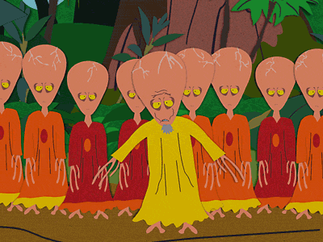

# Neuronet

* [VERSION 8.0.250615](https://github.com/carlosjhr64/neuronet/releases)
* [github](https://github.com/carlosjhr64/neuronet)
* [rubygems](https://rubygems.org/gems/neuronet)

## DESCRIPTION:

Library to create neural networks.

This is primarily a math project meant to be used to investigate the behavior of
different small neural networks.

## INSTALL:
```console
gem install neuronet
```
* Required Ruby version: `>= 3.4`

## SYNOPSIS:

The library is meant to be read, but here is a motivating example:
```ruby
require 'neuronet'
include Neuronet

ff = FeedForward.new([3,3])
# It can mirror, equivalent to "copy":
ff.last.mirror
values = ff * [-1, 0, 1]
values.map { '%.13g' % _1 } #=> ["-1", "0", "1"]
# It can anti-mirror, equivalent to "not":
ff.last.mirror(-1)
values = ff * [-1, 0, 1]
values.map { '%.13g' % _1 } #=> ["1", "0", "-1"]

# It can "and";
ff = FeedForward.new([2,2,1])
ff[1].mirror(-1)
ff.last.connect(ff.first)
ff.last.average
# Training "and" pairs:
pairs = [
  [[1, 1], [1]],
  [[-1, 1], [-1]],
  [[1, -1], [-1]],
  [[-1, -1], [-1]],
]
# Train until values match:
ff.pairs(pairs) do
  pairs.any? { |input, target| (ff * input).map { _1.round(1) } != target }
end
(ff * [-1, -1]).map{ _1.round } #=> [-1]
(ff * [-1,  1]).map{ _1.round } #=> [-1]
(ff * [ 1, -1]).map{ _1.round } #=> [-1]
(ff * [ 1,  1]).map{ _1.round } #=> [1]

# It can "or";
ff = FeedForward.new([2,2,1])
ff[1].mirror(-1)
ff.last.connect(ff.first)
ff.last.average
# Training "or" pairs:
pairs = [
  [[1, 1], [1]],
  [[-1, 1], [1]],
  [[1, -1], [1]],
  [[-1, -1], [-1]],
]
# Train until values match:
ff.pairs(pairs) do
  pairs.any? { |input, target| (ff * input).map { _1.round(1) } != target }
end
(ff * [-1, -1]).map{ _1.round } #=> [-1]
(ff * [-1,  1]).map{ _1.round } #=> [1]
(ff * [ 1, -1]).map{ _1.round } #=> [1]
(ff * [ 1,  1]).map{ _1.round } #=> [1]
```
## CONTENTS:

* [Neuronet wiki](https://github.com/carlosjhr64/neuronet/wiki)

### Mju

Mju is a Marklar which value depends on which Marklar is asked.
Other known Marklars are Mu and Kappa.
Hope it's not confusing...
I tried to give related Marklars the same name.


### Marshal

Marshal works with Neuronet to save your networks:
```ruby
dump = Marshal.dump ff
ff2 = Marshal.load dump
ff2.inspect == ff.inspect #=> true
```
### Base

* [Requires and autoloads](lib/neuronet.rb)
* [Constants and lambdas](lib/neuronet/constants.rb)
* [Connection](lib/neuronet/connection.rb)
* [Neuron](lib/neuronet/neuron.rb)
* [Layer](lib/neuronet/layer.rb)
* [FeedForward](lib/neuronet/feed_forward.rb)

### Scaled

* [Scale](lib/neuronet/scale.rb)
* [Gaussian](lib/neuronet/gaussian.rb)
* [LogNormal](lib/neuronet/log_normal.rb)
* [ScaledNetwork](lib/neuronet/scaled_network.rb)

## LICENSE:

Copyright (c) 2025 CarlosJHR64

Permission is hereby granted, free of charge,
to any person obtaining a copy of this software and
associated documentation files (the "Software"),
to deal in the Software without restriction,
including without limitation the rights
to use, copy, modify, merge, publish, distribute, sublicense, and/or sell
copies of the Software, and
to permit persons to whom the Software is furnished to do so,
subject to the following conditions:

The above copyright notice and this permission notice
shall be included in all copies or substantial portions of the Software.

THE SOFTWARE IS PROVIDED "AS IS",
WITHOUT WARRANTY OF ANY KIND, EXPRESS OR IMPLIED,
INCLUDING BUT NOT LIMITED TO THE WARRANTIES OF MERCHANTABILITY,
FITNESS FOR A PARTICULAR PURPOSE AND NONINFRINGEMENT.
IN NO EVENT SHALL THE AUTHORS OR COPYRIGHT HOLDERS BE LIABLE FOR ANY CLAIM,
DAMAGES OR OTHER LIABILITY, WHETHER IN AN ACTION OF CONTRACT,
TORT OR OTHERWISE, ARISING FROM, OUT OF OR IN CONNECTION WITH
THE SOFTWARE OR THE USE OR OTHER DEALINGS IN THE SOFTWARE.
